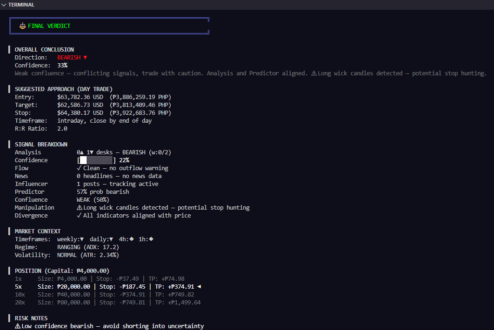

# Koleki 🧠
### Multi-Asset Market Oracle

Terminal-based prediction engine for stocks, crypto, and forex.

## 📸 Preview

  

  

## Features
- 8 specialized workers analyzing 5 independent data layers
- Live data from Binance, Yahoo Finance, CoinGecko
- Machine learning pattern recognition
- Technical analysis with 6 trading desks
- Order flow & funding rate tracking
- Global news & macro event detection
- Influencer & whale activity monitoring
- Manipulation & divergence detection
- Mode-specific analysis (Scalping → Long Term)
- PHP position sizing with multi-leverage scenarios

## Quick Start
Download the latest release from [Releases](link)

## Architecture
[diagram or description of the 8 workers]

## Supported Markets
- Crypto: BTC, ETH, SOL, XRP, DOGE, ADA, LINK, DOT, SHIB, LTC, BCH, PEPE, WIF, BONK
- Stocks: AAPL, TSLA, NVDA, MSFT, GOOGL, AMZN, META, NFLX, OSCR, PLTR, SOFI, RIVN
- Forex: EUR/USD, GBP/USD, USD/JPY, AUD/USD, USD/CAD, NZD/USD, EUR/GBP

## Built by
**l3xtr** — www.linkedin.com/in/mark-despojado-lexstudios28
